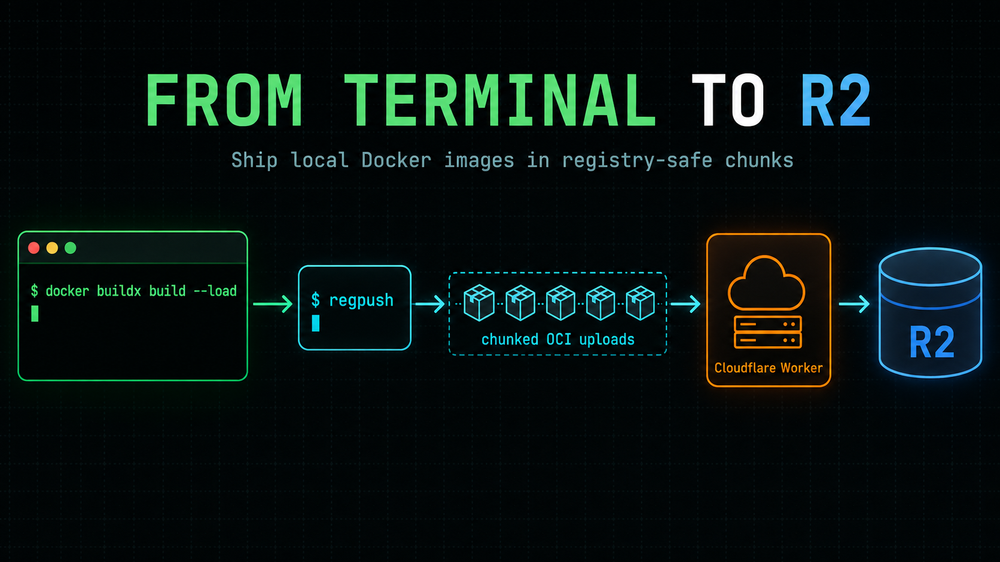

# regpush

**When Docker Hub and other hosted registries get too expensive for your workload, put the blobs in Cloudflare R2. That’s it. That’s the pitch.**

`regpush` pushes an already-built local Docker image to a [`cloudflare/serverless-registry`](https://github.com/cloudflare/serverless-registry)-compatible deployment. It exports the image, compresses its layers, and sends them in bounded chunks through a Cloudflare Worker for storage in R2.



`regpush` is the push client, not the registry server. You still need a compatible Worker and R2 deployment. Pulls continue to use the normal OCI registry interface.

## Why this exists

Container images are mostly immutable blobs. If conventional registry storage or transfer pricing no longer fits your workload, R2 can be a practical backing store—especially when you already use Cloudflare.

The awkward part is getting large image layers through Worker request limits. A normal `docker push` can send a request that is too large. `regpush` speaks the serverless registry’s chunked upload extension instead:

- It requires the image to exist in local Docker.
- It validates the registry, nested repository path, and tag before doing work.
- It uploads layers in bounded chunks with three concurrent workers and bounded retries.
- It skips blobs the registry already has.
- It caches validated compressed artifacts by Docker image ID, so repeated pushes avoid another export and recompression.
- It uploads the manifest only after every layer and the image configuration have succeeded.

## GitHub Action

The action runs on a standard `ubuntu-latest` runner. It ships bundled JavaScript and uses GitHub’s built-in Node.js action runtime, so the consuming workflow does not install Bun, compile anything, or clone this repository.

Build with `--load` so the image is present in the runner’s local Docker daemon, then push it:

```yaml
name: Build and push image

on:
  push:
    branches: [main]

jobs:
  image:
    runs-on: ubuntu-latest
    permissions:
      contents: read
    env:
      IMAGE: registry.example.com/team/app:sha-${{ github.sha }}
    steps:
      - uses: actions/checkout@v4
      - uses: docker/setup-buildx-action@v3

      - name: Build local image
        run: docker buildx build --load --tag "$IMAGE" .

      - name: Push image through the Worker
        uses: wkusaa/regpush@v1
        with:
          image: ${{ env.IMAGE }}
          username: ${{ secrets.REGISTRY_USERNAME }}
          password: ${{ secrets.REGISTRY_PASSWORD }}
```

Use an immutable image tag such as `sha-${{ github.sha }}`. Do not reuse a deployment tag when you can point each build at its exact commit.

### Action inputs

| Input           | Required | Default | Meaning                                                          |
| --------------- | -------- | ------- | ---------------------------------------------------------------- |
| `image`         | yes      | —       | Fully qualified image reference already loaded into Docker       |
| `username`      | yes      | —       | Registry username                                                |
| `password`      | yes      | —       | Registry password                                                |
| `insecure-http` | no       | `false` | Permit plain HTTP; intended only for isolated local testing      |
| `cleanup`       | no       | `false` | Disable caching and remove all temporary artifacts after the run |

Create `REGISTRY_USERNAME` and `REGISTRY_PASSWORD` as GitHub Actions secrets. The action masks both values before starting any subprocess and never passes the password as a command-line argument.

Caching is enabled by default. GitHub-hosted runners are ephemeral, so the cache normally lasts only for the job unless you deliberately persist it. Set `cleanup: true` when image contents must not remain on disk after the step.

## Local CLI

Local use is tested on macOS and Linux. It requires:

- Docker with the target image loaded locally
- Node.js `24.20.0`
- npm

Build once from a clone:

```sh
npm ci
npm run build
```

Provide credentials through the environment, then pass only the image reference on the command line:

```sh
export REGPUSH_USERNAME='registry-user'
read -rs REGPUSH_PASSWORD && export REGPUSH_PASSWORD

node dist/cli.js registry.example.com/team/app:sha-abc123

unset REGPUSH_PASSWORD
```

The full CLI form is:

```text
regpush [--insecure-http] [--no-cache] <registry>/<repository>[:tag]
```

Caching is on by default. `--no-cache` uses a fresh temporary workspace and removes it on both success and failure. `--insecure-http` is opt-in because Basic credentials sent over plain HTTP are visible on the network.

## What a push does

1. Validate the image reference and confirm the image exists in Docker.
2. Reuse a digest-validated image-ID cache when available.
3. Otherwise export the image, extract it, and gzip up to three layers concurrently.
4. Check the registry for each layer and upload only missing content in server-advertised chunks.
5. Upload the OCI manifest after all blobs succeed.
6. Remove export and extraction files. Keep only the validated cache unless caching was disabled.

Progress output includes preparation status, cache hits, per-layer checks, chunk progress, the uploaded layer count, cleanup status, and final success. Rejected or incomplete uploads return a nonzero exit code and do not publish the manifest.

## Cache and limits

The default local cache lives under the operating system’s temporary directory in `regpush-cache`. Cache directories are private to the current user, entries are keyed by Docker image ID, and every cached artifact is checked against its recorded SHA-256 digest before reuse. Incomplete `.part` files are removed.

These optional environment variables tune the built-in safety bounds:

| Variable                     | Default           | Allowed range      |
| ---------------------------- | ----------------- | ------------------ |
| `REGPUSH_CACHE_DIR`          | OS temp directory | Writable directory |
| `REGPUSH_MAX_RETRIES`        | `3`               | `1`–`5`            |
| `REGPUSH_MAX_TEMP_BYTES`     | `20 GiB`          | `1 MiB`–`1 TiB`    |
| `REGPUSH_PROCESS_TIMEOUT_MS` | `600000`          | `1000`–`1800000`   |
| `REGPUSH_REQUEST_TIMEOUT_MS` | `60000`           | `1000`–`300000`    |

## Security model

- HTTPS is the default and insecure HTTP requires an explicit flag or action input.
- Authentication uses Basic auth, but credentials are accepted only through environment variables or masked action inputs.
- Passwords and complete authentication-related response bodies are never logged.
- Image references are validated before they reach Docker or the network.
- The committed action bundle is built from the tagged source and checked in CI.
- Cached files contain image data. Use `--no-cache`, `cleanup: true`, or a protected cache directory when that data is sensitive.

Do not run secret-bearing workflows on untrusted pull-request code. The repository’s pull-request CI uses only a local mock registry and test-only credentials.

## Cloudflare Worker and R2 limitations

- This client needs the chunked protocol implemented by `cloudflare/serverless-registry`; it is not a replacement client for every OCI registry.
- Worker request-body, CPU, execution-time, and subrequest limits still depend on your Cloudflare plan and deployment.
- R2 storage, operation, and lifecycle behavior still apply. This client does not perform garbage collection or delete unreferenced blobs.
- A push targets one image manifest already loaded into Docker; it does not publish a multi-platform build index directly from Buildx.
- Availability and durability depend on your Worker, R2, DNS, and authentication configuration.

## Releases

Immutable releases use full semantic-version tags such as `v1.0.3`. The moving `v1` tag tracks the latest compatible v1 release. Pin the full version when reproducibility matters more than automatic v1 updates.

Source changes, the committed action bundle, and release tags are verified together in CI. Consumers should review release notes before adopting a new immutable version.

## License and attribution

Licensed under the Apache License 2.0. See [LICENSE](LICENSE) and [NOTICE](NOTICE).

`regpush` is derived from the push tool in [`cloudflare/serverless-registry`](https://github.com/cloudflare/serverless-registry). The original project and its contributors are acknowledged in `NOTICE` and the repository history.
